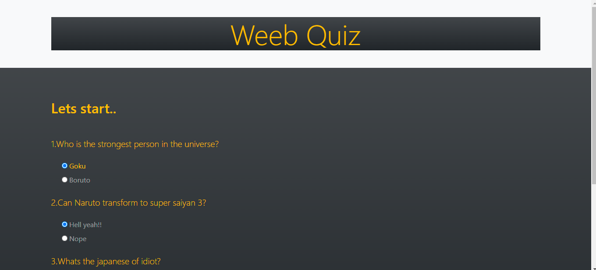
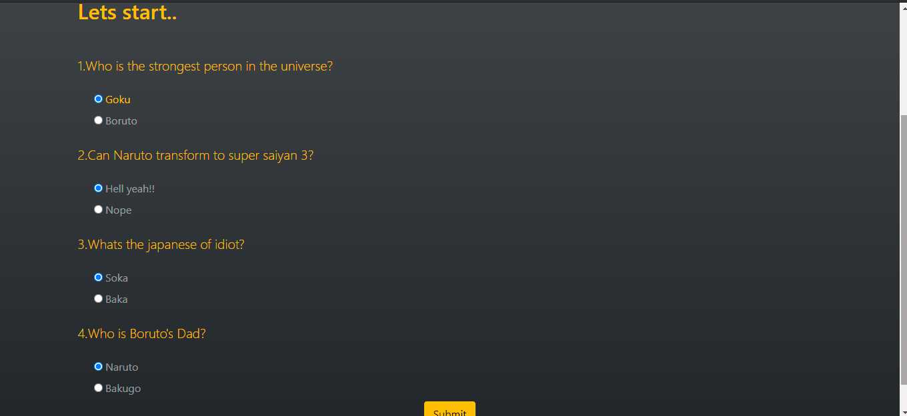
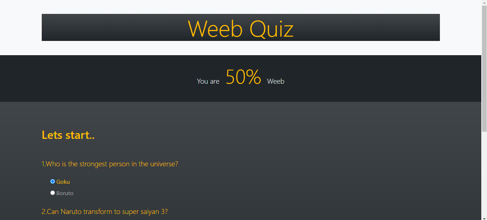

##
This is a simple web app built using the following:-

# This is the layout of the page :boom:

## The result after submit is clicked :raised_hands: 

 
 ##
Will be reworking on the UI part and will add extra few features soon.......

